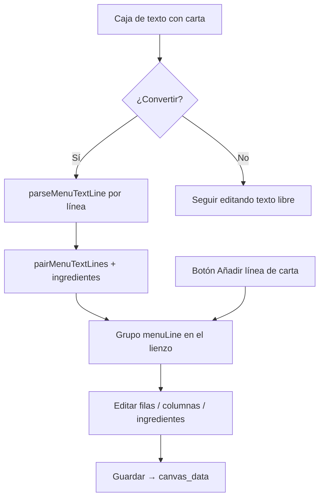

# Línea de carta (`menuLine`)

Módulo del editor para componer filas tipográficas de carta: **nombre del plato**, **separador** (puntos, guiones…) y **precio**, con **ingredientes opcionales** debajo.

Archivos principales:

| Área | Archivo |
|------|---------|
| Modelo | `src/types/canvas.ts` (`MenuLineLayer`, `MenuLineRow`) |
| Layout Fabric | `src/lib/menu-line.ts` |
| Texto → línea | `src/lib/text-to-menu-line.ts` |
| Propiedades | `src/components/editor/MenuLineProperties.tsx` |
| Herramientas | `src/components/editor/Toolbar.tsx` |

---

## Qué es una línea de carta

Una capa `menuLine` es un **grupo Fabric** con varias filas. Cada fila tiene tres columnas:

```
[ Plato          ][ ········· ][ 12,00 € ]
[ ingredientes opcionales a ancho completo     ]
```

| Columna | Rol | Comportamiento de ancho |
|---------|-----|-------------------------|
| Izquierda | Nombre del plato | Ancho fijo (`leftWidth`), configurable |
| Centro | Separador / leader | Rellena el espacio restante |
| Derecha | Precio | Se ajusta al contenido del texto |
| (extra) | Ingredientes | Debajo de la fila, a todo el ancho del bloque |

El **ancho del bloque** se cambia con las asas del lienzo (solo el contenedor). La tipografía **no** se escala al estirar: solo se redistribuyen plato / separador / precio.

---

## Cajas de texto vs línea de carta

### Caja de texto (`text`)

- Capa libre: un `Textbox` de Fabric.
- Ideal para títulos, notas, párrafos o borradores de carta pegados desde otro sitio.
- Formato libre (negrita parcial, varias líneas, etc.).
- **No** alinea automáticamente plato y precio en columnas.

### Línea de carta (`menuLine`)

- Pensada para el patrón clásico de menú restaurante.
- Formato **independiente por columna** (y por fila): fuente, tamaño, color, negrita, alineación.
- Varias filas en el mismo bloque, con espacio entre filas configurable.
- Se selecciona y mueve como **un solo bloque** (hit-test del grupo entero).

**Cuándo usar cada una**

1. Escribes o pegas la carta en una **caja de texto** (rápido, OCR, copiar/pegar).
2. Cuando el contenido ya tiene forma de plato + precio, **conviertes** a línea de carta.
3. O insertas una línea de carta vacía desde la barra y rellenas en propiedades / doble clic.

---

## Herramientas del editor

### Añadir línea de carta

Botón en la barra **Añadir** (icono de plato ··· €).

- Crea un bloque nuevo con una fila de ejemplo.
- Luego puedes añadir filas (+ Fila), editar columnas y el campo **Ingredientes**.

### Convertir texto → línea de carta

Disponible cuando hay **exactamente un** texto seleccionado (no una celda interna de menú):

- Barra: icono de conversión (flecha + plato ··· €).
- Panel de propiedades del texto: **→ Línea de carta**.

Sustituye la caja de texto por un grupo `menuLine` en la misma posición, conservando id/nombre de capa cuando existen.

Implementación: `convertTextObjectToMenuLine` → `buildMenuLineLayerFromTextbox` → `menuLineLayerToGroup`.

---

## Conversión desde texto (detalle)

### 1. Partir en líneas

El contenido del `Textbox` se normaliza (`\r\n` → `\n`) y se procesa **línea a línea**. Las líneas vacías se ignoran.

### 2. Detectar plato + precio en una línea

`parseMenuTextLine` busca un **precio al final** de la línea:

- Formatos reconocidos (ejemplos): `10,00 €`, `€10,00`, `$12.50`, `12€`, `12,50`.
- **No** se considera precio un entero suelto sin moneda ni decimales (así `Ingrediente 3` no se confunde con un precio).
- Separación entre nombre y precio:
  - espacios múltiples,
  - puntos / puntos líderes (`····`, `.....`),
  - guiones repetidos (`----`, `––––`).

Ejemplos válidos:

```text
Margarida ................................................................ 10,00 €
De la Casa –––––––––––––––––––––––––––––––––––––––––––––––––––––––– 14,00 €
Pollastre              12,00 €
```

Si **no** hay precio reconocible, toda la línea se trata como nombre de plato (precio vacío → se muestra `—` en la columna derecha).

El tipo de separador (puntos / guiones / espacios) se infiere del relleno entre plato y precio.

### 3. Emparejar ingredientes (automático)

No hace falta marcar “esta línea son ingredientes”.

Tras parsear, `parseMenuTextBlocks` aplica:

1. Línea **con precio** → fila de carta.
2. Si la **siguiente** línea de contenido está **pegada** (sin líneas en blanco en medio),
   no tiene precio y parece lista de ingredientes (`looksLikeIngredients`),
   → se guarda como `row.ingredients` de esa fila.
3. Las **líneas en blanco** que siguen al bloque (plato ± ingredientes) → `blankLinesAfter`
   (espacio vertical extra antes del siguiente plato o al final del bloque).

Una línea “parece ingredientes” si:

- tiene **al menos dos** trozos en la **misma línea** separados por ` - ` / ` – ` / ` — `, comas `,` o punto y coma `;`, **o**
- el OCR deja **varios ítems en líneas seguidas** (p. ej. `Pollo,` / `Nueces,` / `Legumbres`), sin línea en blanco hasta el siguiente plato.

Al convertir, los ítems se **unen en una sola cadena** con el separador de la herramienta (` - `) y van **solo** al campo editable **Ingredientes** de esa fila. El nombre del plato queda en la columna **Plato**; los ingredientes **no** crean filas nuevas.

Si el OCR inserta líneas en blanco entre el plato y cada ítem, también se emparejan (no hace falta que vayan pegados sin huecos).

```text
Mozzarella - Tomàquet - Albérrega
Bacó - Pernil dolç - Xorxíço - Xampinyons
Ingrediente 1, Ingrediente 2, Ingrediente 3
Tomate; Cebolla; Pimiento
```

Ejemplo OCR multilínea:

```text
Pollo Tandori .............. 3,00 €
Pollo,
Nueces,
Legumbres

Gambas Tandori .............. 3,00 €
Gamba,
Ajo,
Perejil
```

Resultado: **2 filas** de carta; ingredientes `Pollo - Nueces - Legumbres` y `Gamba - Ajo - Perejil` en el textbox **Ingredientes** de cada fila.

Ejemplo con separación entre platos (una sola línea de ingredientes):

```text
Margarida ................................................................ 10,00 €
Mozzarella - Tomàquet - Albérrega

Pernil i Formatge .................................................... 12,00 €
Pernil dolç - Formatge - Tomàquet - Mozzarella
```

Resultado: **2 filas**, cada una con ingredientes; la primera lleva `blankLinesAfter: 1` por la línea vacía.

### 4. Estilos al convertir

Se toman del `Textbox` de origen (familia, tamaño, color, peso, estilo) y se adaptan:

| Parte | Ajuste típico |
|-------|----------------|
| Plato | Misma fuente; alineación izquierda |
| Separador | Un poco más pequeño; color gris |
| Precio | Negrita; alineación derecha |
| Ingredientes | ~3 px más pequeño; color gris; sin negrita |

El ancho del bloque se basa en el del texto original. `leftWidth` se estima midiendo el nombre de plato más largo (no los ingredientes).

---

## Edición posterior

En el panel **Línea de carta**:

- Selector de **fila** (o **Todas** para formato de una columna en todas las filas).
- Pestañas **Plato / Separador / Precio**.
- Campo **Ingredientes** por fila (crear, editar o vaciar).
- **Saltos después de esta fila**: líneas en blanco extra tras el plato (y sus ingredientes).
- Separador: puntos, guiones, espacios o **personalizado** (un solo símbolo que se
  repite solo hasta llenar el hueco).
- Espacio entre filas (base global); ancho de columna plato (slider).

Al guardar el menú, el grupo se serializa a `MenuLineLayer` (`menuLineGroupToLayer`) e incluye `ingredients` y `blankLinesAfter` cuando aplica.

---

## Modelo de datos (resumen)

```ts
MenuLineRow {
  left, center, right: MenuLineCell   // content + style
  ingredients?: MenuLineCell          // opcional, bajo la fila
  blankLinesAfter?: number            // saltos extra tras la fila
  leader?: 'dots' | 'dashes' | 'spaces' | 'custom'
}

MenuLineLayer {
  type: 'menuLine'
  width, leftWidth, rowGap, leader
  rows: MenuLineRow[]
  // columnRatios: snapshot / compat
}
```

En Fabric, cada celda es un `Textbox` hijo con `menuLineRole` (`left` | `center` | `right` | `ingredients`) y `menuLineRowIndex`.

---

## Consejos prácticos

1. **Pegar desde una carta:** mantén una línea por plato (nombre + puntos + precio). Los ingredientes pueden ir en la línea siguiente (guiones/comas/punto y coma) o en varias líneas OCR seguidas (`Pollo,` / `Nueces,`…). Al convertir se unifican con ` - `. Líneas vacías entre platos = más espacio vertical.
2. **Títulos de sección** (p. ej. “Pizzes”) en una caja de texto aparte, o como fila sin precio si quieres que queden dentro del bloque.
3. Tras convertir, revisa el campo **Ingredientes** de cada fila: debe mostrar la lista editable en una sola línea. Ajusta **Saltos después** si hace falta más aire.
4. Cartas ya publicadas con versiones antiguas de layout pueden necesitar **guardar y republicar** para verse bien en `/p/...`.
5. **Exportar / importar JSON** incluye las líneas de carta (filas, precios, ingredientes, formato y saltos) en el `menu.json`.

---

## Flujo rápido


